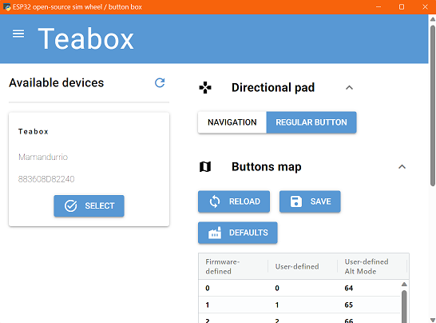

# Configuration app for ESP32-based open-source sim wheels / button boxes

A companion app for [ESP32 based open-source wireless steering wheel](https://github.com/afpineda/OpenSourceSimWheelESP32).

## Features

- Load/save from/to file.
- Handle multiple connected devices.
- Choose working mode of clutch paddles, "ALT" buttons and/or directional pad.
- Set clutch bite point.
- Force auto-calibration of analog clutch paddles.
- Force battery auto-calibration (not available if the battery was "factory-calibrated" previously).
- Map hardware buttons to user-defined HID buttons.
- Supports all firmware versions to date (data versions 1.0 and 1.1).
- Windows / Linux / Mac
- UI languages (automatically detected):
  - English (default)
  - Español (Spanish)

## User documentation

[Installing and running](./doc/Install_en.md)

[Usage notes](./doc/UsageNotes_en.md)

## Known issues / Troubleshooting

### User interface not showing

As a workaround, open your web browser and try one of these URL: `localhost:8000` or `localhost:8080`.
The user interface will show in your browser.

## Other

[Change log](./doc/ChangeLog.md)

[Notes for software developers](./doc/Dev_notes.md)

### Licensed work

This project uses the following libraries under a compatible license:

- ["hidapi"](https://github.com/trezor/cython-hidapi) from Gary Bishop:

  Available under several licenses, including public domain.

- ["nicegui"](https://nicegui.io/) from Zauberzeug GmbH:

  Available under [MIT license](https://mit-license.org/).

- ["appstrings"](ttps://github.com/afpineda/appstrings-python) from this author:

  Available under EUPL license.
